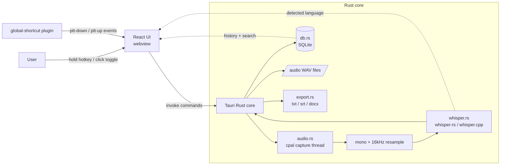

# System diagram

## Command surface (Rust ↔ UI)

| Command | Purpose |
|---|---|
| `list_input_devices` | microphones for the settings picker |
| `start_recording` / `stop_recording` / `cancel_recording` | capture lifecycle; stop returns the transcript |
| `is_recording` / `get_level` | UI state + live level meter |
| `list_recordings` / `get_recording` / `delete_recording` | history + detail |
| `export_recording` | write .txt / .srt / .docx to a chosen path |
| `get_settings` / `update_settings` | persisted settings + hotkey re-register |
| `list_models` / `app_status` | which models are present, backend info |

## Data flow on stop

1. `stop_recording` takes the capture handle, stops the thread, gets raw samples.
2. Downmix → resample to 16 kHz → pad.
3. `AppState::transcribe` loads the model (lazily, swaps if changed) and runs Whisper.
4. Language is read from Whisper when mode is `auto`.
5. WAV saved to the app data dir; row + segments inserted into SQLite.
6. Result returned to the UI and added to history.
